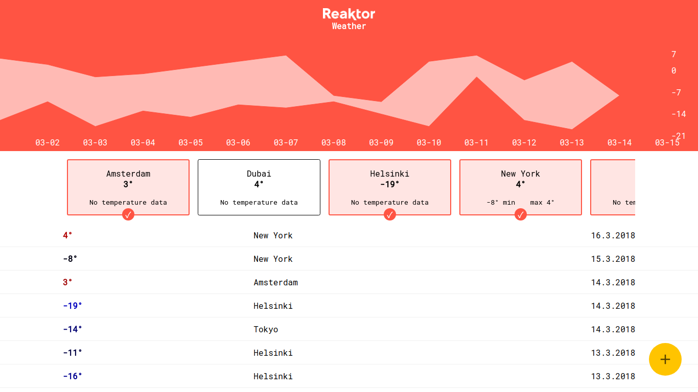

# Reaktor Weather

**Reaktor Weather** is demonstration for Reaktor, company I'm seeking to work at on the summer 2018.

With this app you can add and browse weather observations at various places. Application also calculates minimum and maximum temperatures of 24 hours for each location individually. These were outlines for the assignment company provided for all job seekers. I also implemented filtering by city and good looking area chart to the app as an extra.

**Stuff I used to build up the app:**

* **Node.js** as a run environment
* **MySQL** as a database
* **[Recharts](http://recharts.org)** for beautiful area chart
* **[Jest](https://facebook.github.io/jest/)** for unit tests
* **[Travis CI](https://travis-ci.org/petja/reaktor-weather)** for continuous integration
